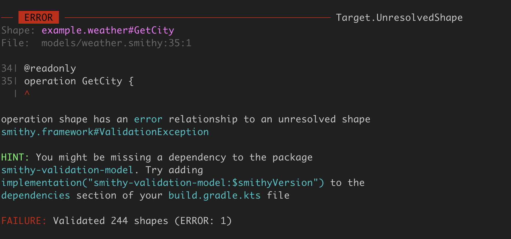

# Custom Validation Decorators

The examples in this directory demonstrate how to create a custom validation decorator package for Smithy.

Validation events can be sometimes confusing for newcomers to Smithy, and adding some guidance on how to solve
Validation decorators allow Smithy users to attach additional hints to Validation events to provide such guidance. 

### Custom Validation Decorators Package

A custom validation decorator package can be created and added as a dependency to your build system or model package.
For instance, the Smithy Gradle plugin can be wrapped in an internal package that also has a dependency on your
decorator package. This way all the users of the internal package will also depend on the decorators package
without them also having to know about it.

Smithy uses the Java
[Service Provider Interfaces](https://docs.oracle.com/javase/tutorial/sound/SPI-intro.html) (SPI) to discover
all the packages offering this service and pass each of the validation events through the provided decorators 
generated.

In order for the package to expose the service interfaces it provides it MUST include a
`META-INF/services/software.amazon.smithy.model.validation.ValidationEventDecorator` file inside the jar,
usually packaged by the build system when found in the `src/main/resources` directory. The file contains the
fully qualified names of the classes that implement the interface. For this example it contains:

```
io.smithy.examples.decorators.DecorateUnresolvedShapeEvent
io.smithy.examples.decorators.DecorateUnresolvedTraitEvent
```

For the two decorators implemented in this package, `DecorateUnresolvedShapeEvent` and
`DecorateUnresolvedTraitEvent`.

### Custom Validation Decorators Class

A custom validation decorator class must implement the
[`software.amazon.smithy.model.validation.ValidationEventDecorator`](https://smithy.io/javadoc/1.32.0/software/amazon/smithy/model/validation/ValidationEventDecorator.html)
interface. This class just consists of two methods:

```java
/** Returns true if this decorator knows how to decorate this event, usually by looking at the event id. */
boolean canDecorate(ValidationEvent ev)

/** Takes an event and potentially updates it to decorate it. */
ValidationEvent decorate(ValidationEvent ev)
```

The `canDecorate` method serves as a quick filter for the decorator to let Smithy know whether it knows how to
decorate the given event. This usually can be done by using the id of the event which defaults to the name of
the validator.

The `decorate` method adds additional information to the the validation event by updating the event object but might decide not to and return it
as-is. Implementations can decide how exactly to update the event but the best way is to add a "hint" to
nudge the user towards the right solution for the problem.

### Example for Gradle

The example contained in this package assumes that the user is using [`Gradle`](https://gradle.org/) as a
build system and Kotlin for the configuration `build.gradle.kts`, when a validation event for an unresolved
shape or trait is found that is recognized, it will add a HINT to the validation event to point the user to
the right way to solve the issue. Something like:

```
You might be missing a dependency to the package `smithy-validation-model`. Try adding `implementation("smithy-validation-model:$smithyVersion")` to the `dependencies` section of your `build.gradle.kts` file
```

And Smithy will add nice formatting to the output. Something similar to the image below.

## Building
To build this package run the following from the root of the package:

```
./gradlew clean build
```

This will generate a `build` directory containing the build artifacts generated by
gradle. The generated JAR file that should be used by downstream consumers can be
found at `build/libs/decorators.jar`





### Use as a template
To use this example as a template run the following.

```console
smithy init -t decorators
```

---
